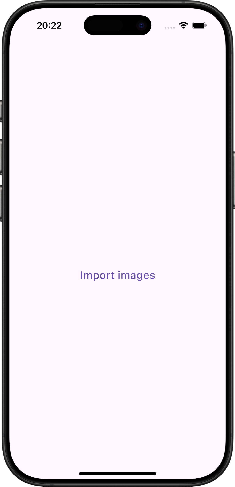
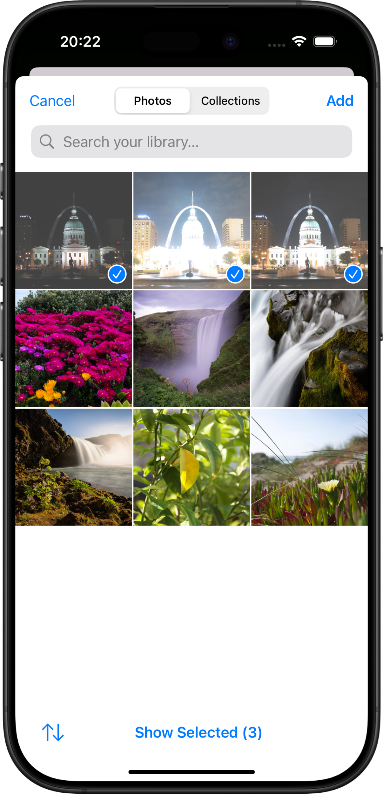
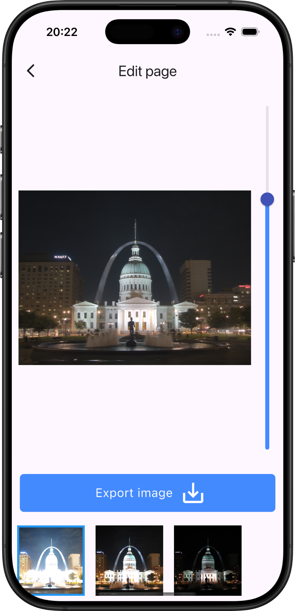
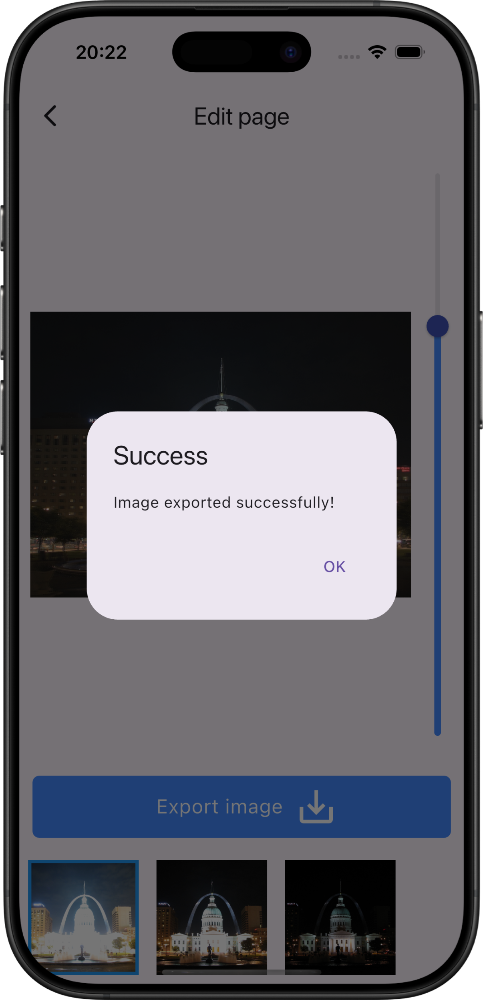
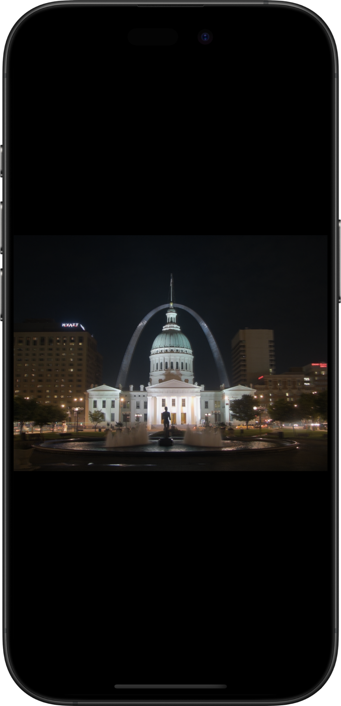

# HDR Merger
## Mobile app to merge HDR images

HDR Merger is an application designed to merge multiple exposure images into a single High Dynamic Range (HDR) image. The tool simplifies the process of combining several images with different exposure levels to produce a final image with enhanced details in both shadows and highlights.

- **Easy Merging Process:** Combine several images with different exposure values into one HDR image.
- **Support for Multiple Formats:** Works with various common image file formats.
- **Customizable Output:** Options to tweak settings according to your HDR merging needs.

## Usage
<table>
    <tr>
        <td>
<h3>Step 1</h3>

Open the app and navigate to the home page.

        </td><td>
<h3>Step 2</h3>

Import all images with different exposures into the app.

        </td></tr><tr><td>
<h3>Step 3</h3>

Adjust the opacity for each image until the desired result is achieved.

        </td><td>
<h3>Step 4</h3>

Export the image and wait until it has been saved.

        </td></tr><tr><td>
<h3>Step 5</h3>

Make sure the image is saved in your phone's gallery.

</td></tr></table>

## License
This project is licensed under the MIT License - see the [LICENSE](LICENSE) file for details.
